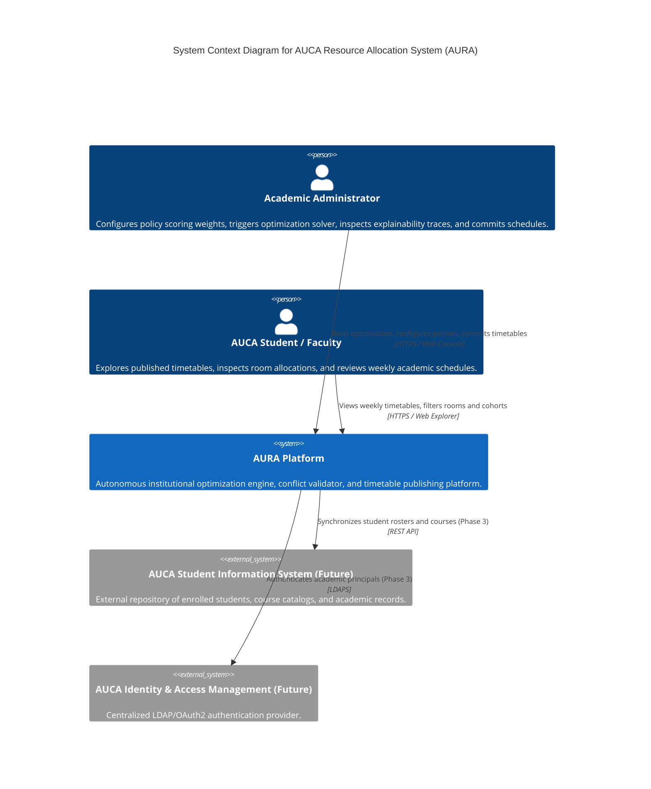
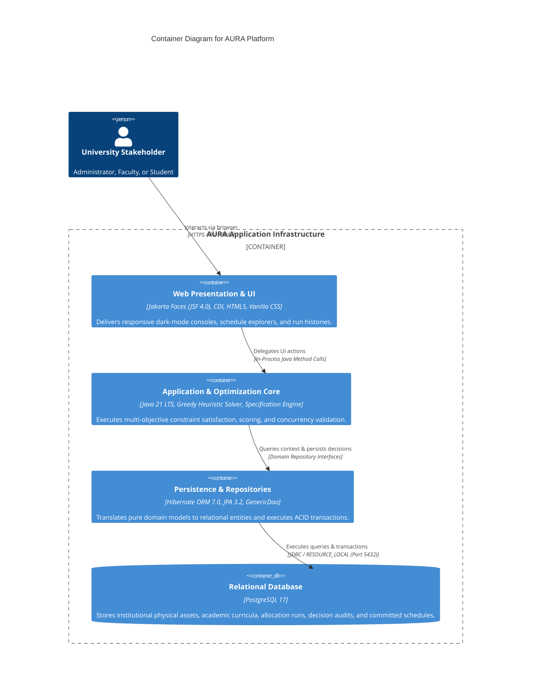
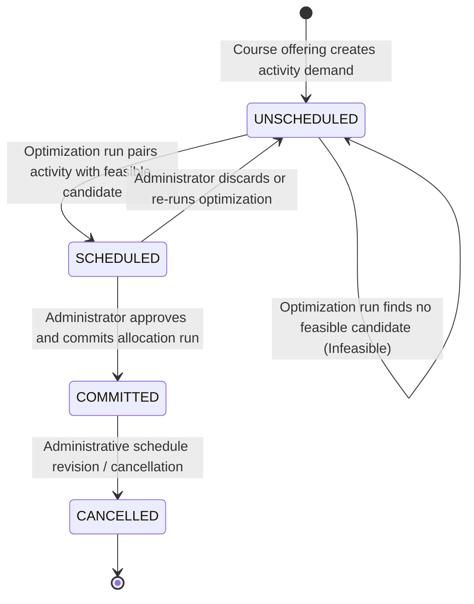
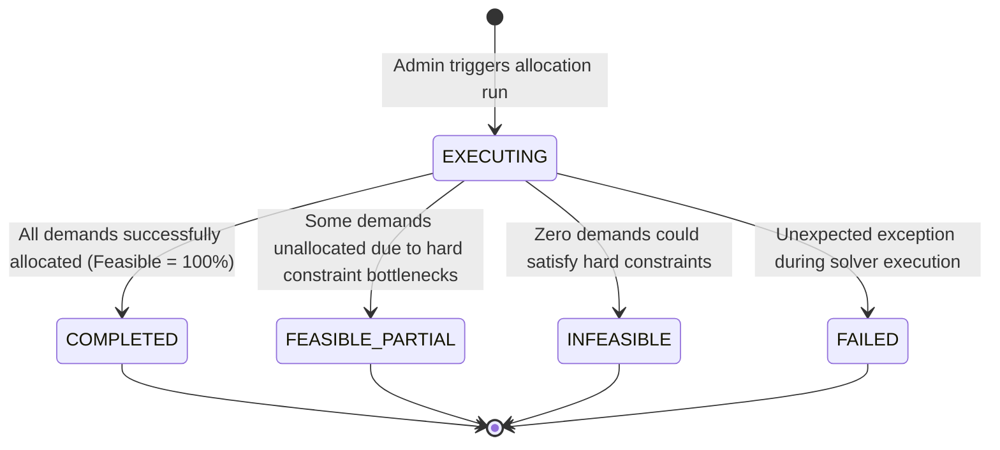
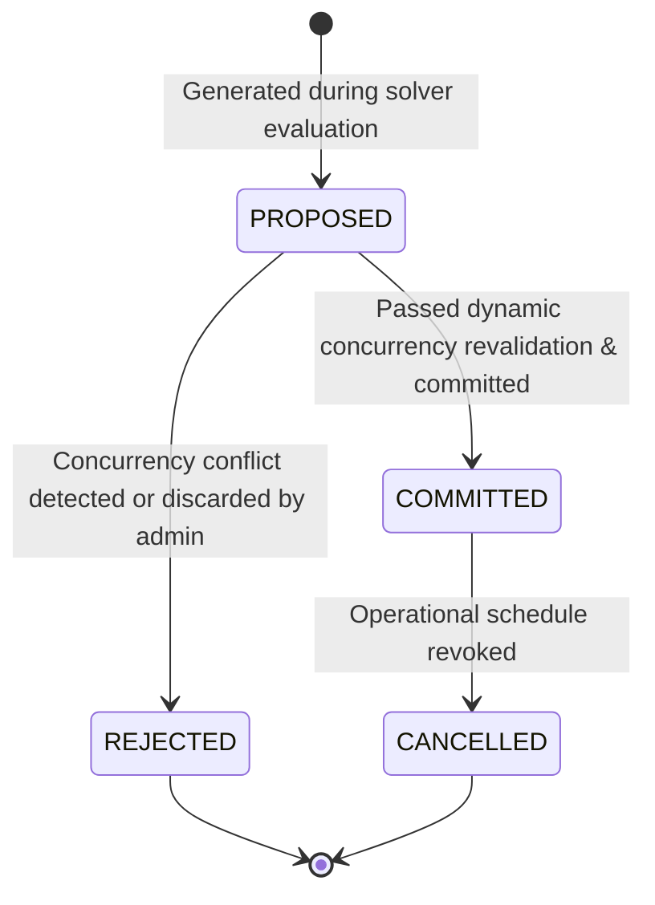
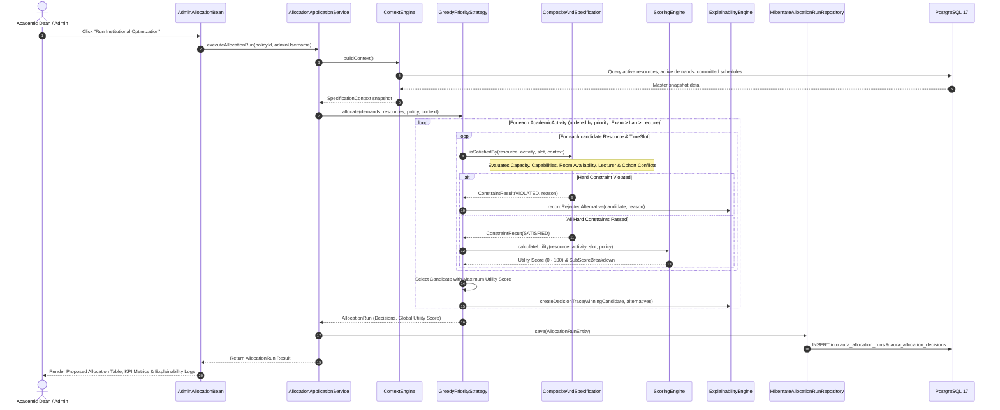

# AURA System Architecture & Engineering Specification

[](https://martinfowler.com/bliki/MonolithFirst.html)
[](https://blog.cleancoder.com/uncle-bob/2012/08/13/the-clean-architecture.html)
[](https://jdk.java.net/21/)
[](https://jakarta.ee/)

This document defines the architectural blueprints, tactical and strategic Domain-Driven Design (DDD) patterns, component topologies, state machine lifecycles, and concurrency control invariants for the **AURA (AUCA Resource Allocation & Optimization System)** platform.

---

## 1. Institutional Context & System Mission

### 1.1 The Institutional Scheduling Challenge
Universities routinely struggle with resource contention: lecture halls are over-booked while specialized computer laboratories sit idle; student cohorts are assigned overlapping classes; instructors are scheduled across different campuses with zero transit time.

Traditional room booking software operates under a simple, reactive question:
> **"Is Room 101 available at 08:00 on Monday?"**

AURA solves the problem globally by reframing the question as a multi-objective optimization problem:
> **"Given all competing academic demands, faculty availability, student cohort progression, required physical capabilities, multi-campus transit constraints, and university policy weights—what is the mathematically optimal, conflict-free institutional timetable?"**

---

## 2. C4 Architecture Models

### 2.1 Level 1: System Context Diagram
The System Context diagram illustrates how AUCA administrators, faculty, and students interact with AURA, and where AURA sits in relation to external university infrastructure.



### 2.2 Level 2: Container Diagram
AURA is containerized as a lean, highly resilient service stack orchestrated via Docker Compose:



---

## 3. Clean / Hexagonal Architectural Layers

AURA follows a strict **Onion / Clean Architecture** pattern. Outer infrastructure layers depend strictly inward upon inner business layers. The Domain Core has **zero dependencies** on frameworks, web libraries, or JPA annotations.

```
┌─────────────────────────────────────────────────────────────────────────┐
│                      PRESENTATION LAYER (JSF 4.0)                       │
│       AdminAllocationBean, StudentIntentBean, Custom UI Components       │
└────────────────────────────────────┬────────────────────────────────────┘
                                     │ calls
┌────────────────────────────────────▼────────────────────────────────────┐
│                       APPLICATION SERVICE LAYER                         │
│           AllocationApplicationService, AcademicContextEngine            │
└────────────────────────────────────┬────────────────────────────────────┘
                                     │ orchestrates
┌────────────────────────────────────▼────────────────────────────────────┐
│                          DOMAIN CORE LAYER                              │
│   Entities: AcademicActivity, Resource, TimeSlot, AllocationRun         │
│   Specifications: Capacity, Capability, Availability, ConflictSpecs     │
│   Scoring: ScoringEngine, GreedyPriorityStrategy, ExplainabilityEngine  │
└────────────────────────────────────▲────────────────────────────────────┘
                                     │ implements
┌────────────────────────────────────┴────────────────────────────────────┐
│                    REPOSITORY & INFRASTRUCTURE LAYER                    │
│   Interfaces: ResourceRepository, AllocationRepository, RunRepository  │
│   Impls: GenericDao, Hibernate*Repository, JPA Entities, Mappers        │
│   Persistence: JpaUtil, PostgreSQL 17, DatabaseInitializer              │
└─────────────────────────────────────────────────────────────────────────┘
```

### 3.1 Package Organization Map

| Package Path | Architectural Layer | Responsibilities & Design Rules |
|---|---|---|
| `rw.ac.auca.aura.domain.shared` | Domain Shared Kernel | Fundamental value objects (`Capability`, `CapabilitySet`, `TimeSlot`, `ScoreBreakdown`). |
| `rw.ac.auca.aura.domain.resource` | Domain Spatial Subdomain | Physical models (`Site`, `Building`, `Resource`, `ResourceType`, `ResourceStatus`). |
| `rw.ac.auca.aura.domain.academic` | Domain Academic Subdomain | Curriculum & demand entities (`AcademicActivity`, `Course`, `CourseOffering`, `Department`, `Lecturer`, `StudentCohort`). |
| `rw.ac.auca.aura.domain.constraint` | Domain Specification Rules | Hard constraint rules implementing `ResourceSpecification` (`CapacitySpecification`, `CapabilitySpecification`, `ResourceAvailabilitySpecification`, `LecturerConflictSpecification`, `CohortConflictSpecification`, `SiteCompatibilitySpecification`). |
| `rw.ac.auca.aura.domain.allocation` | Domain Optimization Solver | Solvers and audit engines (`GreedyPriorityStrategy`, `ScoringEngine`, `ExplainabilityEngine`, `AllocationDecision`). |
| `rw.ac.auca.aura.domain.repository` | Domain Repository SPI | Dependency Inversion interfaces (`ResourceRepository`, `AllocationRepository`, `AllocationRunRepository`, etc.). |
| `rw.ac.auca.aura.application.*` | Application Services | Orchestrates transactions, snapshot generation, dynamic revalidation, and use cases. |
| `rw.ac.auca.aura.infrastructure.persistence.entities` | Infrastructure Persistence | JPA Entity mappings (`*Entity.java`) targeting PostgreSQL `aura_*` tables. |
| `rw.ac.auca.aura.infrastructure.persistence.mappers` | Infrastructure Mappers | Pure Domain $\longleftrightarrow$ JPA Entity bi-directional conversion. |
| `rw.ac.auca.aura.infrastructure.persistence.repositories` | Infrastructure Persistence | Hibernate JPA implementations extending `GenericDao<T, ID>`. |
| `rw.ac.auca.aura.presentation` | Presentation (JSF) | Backing beans (`AdminAllocationBean`, `StudentIntentBean`) and Facelet views. |

---

## 4. Entity Lifecycles & State Machines

### 4.1 AcademicActivity Lifecycle
Every demand unit advances through a deterministic four-state lifecycle:



### 4.2 AllocationRun Lifecycle
Optimization runs capture engine executions:



### 4.3 Allocation Entity Lifecycle
Committed schedules published for institutional display:



---

## 5. End-to-End Optimization Execution Sequence



---

## 6. Concurrency Revalidation Invariant

A critical architectural requirement is that **no double-booking may ever enter the database**, even under concurrent administrator sessions:

```
T0: Admin A starts Optimization Run (Snapshot: 10 committed allocations)
T1: Admin B starts Optimization Run (Snapshot: 10 committed allocations)
T2: Admin A commits Run A (Creates Allocation 11 for Room 101 on Mon 08:00) -> SUCCESS
T3: Admin B attempts to commit Run B (Proposes Room 101 on Mon 08:00)
    │
    ▼
    [ Transactional Concurrency Revalidation in commitRun() ]
    1. Query fresh committed allocations from PostgreSQL inside active transaction.
    2. Check: Does Room 101 have an overlapping committed allocation on Mon 08:00?
    3. Collision DETECTED (Allocation 11 from Admin A).
    4. Transaction is immediately ABORTED / ROLLED BACK.
    5. Admin B receives explicit error: "Concurrency conflict: Room 101 is already committed at target timeslot."
```

---

## 7. Extensibility & Future Architecture (Phase 3 Roadmap)

AURA's modular monolith architecture provides clean extension points without refactoring existing domain code:

1. **Alternative Optimization Solvers**: Implement `AllocationStrategy` to swap the greedy heuristic for a Genetic Algorithm (GA), Integer Linear Programming (ILP via OptaPlanner/Timefold), or Simulated Annealing.
2. **New Hard Constraints**: Implement `ResourceSpecification` (e.g., `MaxConsecutiveLecturesSpecification`, `WheelchairAccessibilitySpecification`) and inject into `CompositeAndSpecification`.
3. **Role-Based Access Control (RBAC)**: Enforce security filters on CDI backing beans (`@RolesAllowed("ADMIN")`, `@RolesAllowed("STUDENT")`).
4. **SIS Real-Time Integration**: Implement messaging adapters (Kafka / RabbitMQ) under `infrastructure/messaging` to synchronize enrollments automatically.
