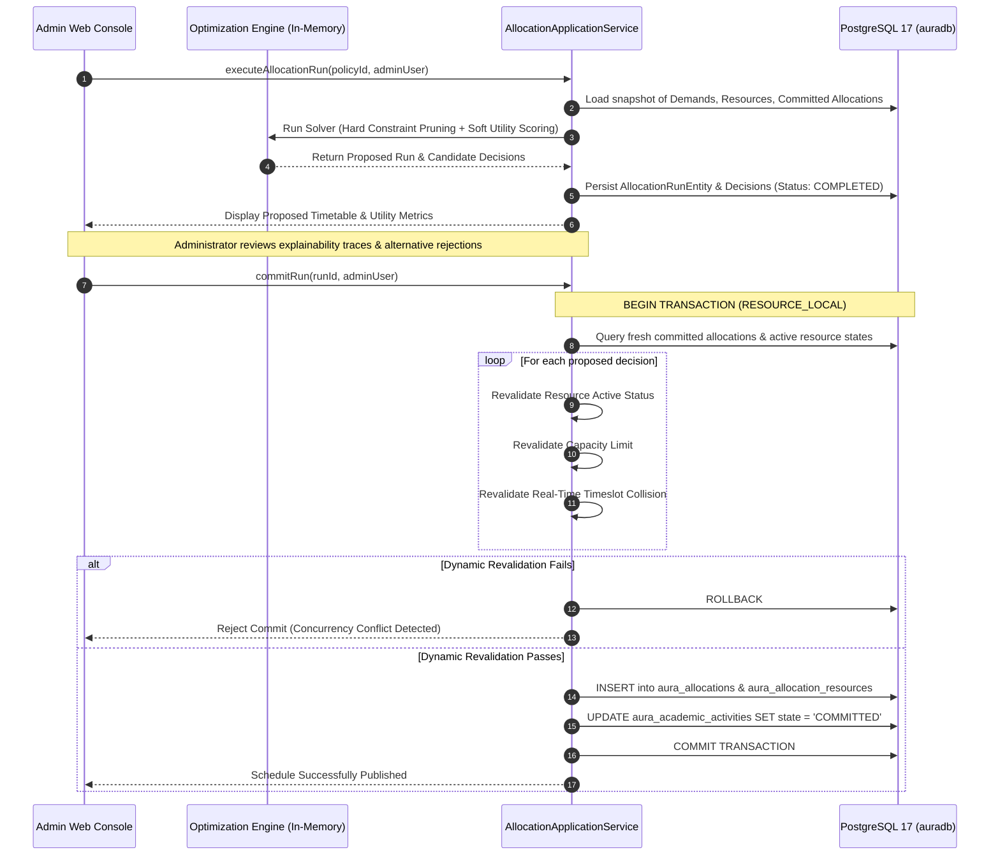

# AURA Database Schema & Persistence Architecture Specification

[](https://www.postgresql.org/)
[](https://jakarta.ee/specifications/persistence/)
[](https://hibernate.org/)
[](https://en.wikipedia.org/wiki/Third_normal_form)

This document provides the definitive architectural reference, Entity-Relationship Diagram (ERD), table specifications, indexing strategy, concurrency mechanisms, and data dictionary for the **AURA (AUCA Resource Allocation & Optimization System)** relational persistence layer.

---

## 1. Architectural Philosophy & Normalization Strategy

AURA is an institutional optimization and decision-support engine for the Adventist University of Central Africa (AUCA). Its database design balances **strict relational normalization (3NF/BCNF)** for operational integrity with **semi-structured analytical document payloads (JSON)** for explainability and auditability.

### 1.1 Key Persistence Principles
1. **Separation of Concerns**: Pure domain models (`rw.ac.auca.aura.domain.*`) contain zero JPA or database annotations. All persistence logic is encapsulated in JPA entities (`rw.ac.auca.aura.infrastructure.persistence.entities.*`) and translated via bi-directional mappers.
2. **Authoritative Spatial Hierarchy**: Physical university facilities follow a strict strict tree:
   $$\text{Site} \longrightarrow \text{Building} \longrightarrow \text{Resource}$$
   `Building.site_id` is the authoritative physical foreign key. `Resource.site_id` is persisted as a denormalized search accelerator to enable instant compound index lookups during timeslot candidate generation without requiring table joins on every heuristic cycle.
3. **Academic Activity as Core Demand Unit**: Timetable allocation operates on `aura_academic_activities` (representing scheduled lectures, lab practicals, examinations, or seminars for a course offering and student cohorts), rather than generic "room bookings."
4. **First-Class Optimization Traces**: Optimization runs (`aura_allocation_runs`) and granular activity decisions (`aura_allocation_decisions`) are immutable audit records. Every rejected alternative, constraint failure, and utility sub-score is captured for administrative transparency.
5. **Multi-Resource Normalization**: To support courses requiring multiple physical resources (e.g., lecture room + overflow audio lab), allocations link to resources via the normalized join entity `aura_allocation_resources`.

---

## 2. Entity-Relationship Diagram (ERD)

The complete relational schema comprises **21 tables**: 17 JPA entity tables and 4 relational join tables.

```mermaid
erDiagram
    %% ==========================================
    %% PHYSICAL SPATIAL DOMAIN
    %% ==========================================
    aura_sites ||--o{ aura_buildings : "contains (1:N)"
    aura_buildings ||--o{ aura_resources : "houses (1:N)"
    aura_sites ||--o{ aura_resources : "accelerates lookup (1:N)"

    %% ==========================================
    %% ACADEMIC STRUCTURE DOMAIN
    %% ==========================================
    aura_departments ||--o{ aura_programs : "administers (1:N)"
    aura_departments ||--o{ aura_lecturers : "employs (1:N)"
    aura_programs ||--o{ aura_courses : "curates (1:N)"
    aura_programs ||--o{ aura_student_cohorts : "enrolls (1:N)"
    aura_student_cohorts ||--o{ aura_students : "groups (1:N)"

    %% ==========================================
    %% COURSE OFFERING & DEMAND DOMAIN
    %% ==========================================
    aura_courses ||--o{ aura_course_offerings : "schedules (1:N)"
    aura_course_offerings ||--o{ aura_offering_lecturers : "teaches"
    aura_lecturers ||--o{ aura_offering_lecturers : "assigned to"
    aura_course_offerings ||--o{ aura_offering_cohorts : "attends"
    aura_student_cohorts ||--o{ aura_offering_cohorts : "enrolled in"

    aura_course_offerings ||--o{ aura_academic_activities : "spawns demands (1:N)"
    aura_academic_activities ||--o{ aura_activity_lecturers : "instructs"
    aura_lecturers ||--o{ aura_activity_lecturers : "participates in"
    aura_academic_activities ||--o{ aura_activity_cohorts : "populates"
    aura_student_cohorts ||--o{ aura_activity_cohorts : "scheduled for"

    %% ==========================================
    %% OPTIMIZATION & ALLOCATION DOMAIN
    %% ==========================================
    aura_allocation_runs ||--o{ aura_allocation_decisions : "evaluates (1:N)"
    aura_allocation_runs ||--o{ aura_allocations : "commits (1:N)"
    aura_academic_activities ||--o{ aura_allocations : "fulfills (1:N)"
    aura_allocations ||--o{ aura_allocation_resources : "reserves (1:N)"
    aura_resources ||--o{ aura_allocation_resources : "assigned via"

    %% ==========================================
    %% TABLE DEFINITIONS WITH ATTRIBUTES
    %% ==========================================
    aura_sites {
        varchar id PK "Site Identifier (e.g. SITE-MASORO, SITE-GISHUSHU)"
        varchar name "Campus Name"
        varchar location_code "Official Campus Code"
    }

    aura_buildings {
        varchar id PK "Building Identifier"
        varchar name "Building Name"
        varchar site_id FK "Parent Site Reference"
    }

    aura_resources {
        varchar id PK "Resource Identifier (e.g. LAB-101)"
        varchar name "Facility Name"
        varchar type "LECTURE_HALL, COMPUTER_LAB, etc."
        int capacity "Seating Capacity"
        varchar building_id FK "Parent Building Reference"
        varchar site_id FK "Cached Site Reference"
        varchar status "AVAILABLE, MAINTENANCE, RESERVED, OFFLINE"
        varchar capabilities_json "JSON Array of Capabilities"
    }

    aura_departments {
        varchar id PK "Department Identifier"
        varchar name "Department Name"
        varchar faculty "Governing Faculty / School"
    }

    aura_programs {
        varchar id PK "Academic Program Identifier"
        varchar name "Degree Program Title"
        varchar department_id FK "Parent Department Reference"
    }

    aura_courses {
        varchar id PK "Course Primary Key"
        varchar code UK "Course Code (e.g. INSY 321)"
        varchar title "Course Catalog Title"
        int credit_hours "Credit Units"
        varchar program_id FK "Degree Program Reference"
    }

    aura_lecturers {
        varchar id PK "Lecturer Primary Key"
        varchar staff_number UK "Institutional Staff ID"
        varchar full_name "Faculty Full Legal Name"
        varchar email "Academic Email Address"
        varchar department_id FK "Home Department Reference"
    }

    aura_student_cohorts {
        varchar id PK "Cohort Identifier (e.g. SE-Y3-2026)"
        varchar name "Cohort Display Name"
        varchar program_id FK "Academic Program Reference"
        int academic_year "Current Progression Year"
        int student_count "Headcount of Active Students"
    }

    aura_students {
        varchar id PK "Student Primary Key"
        varchar student_number UK "AUCA Registration ID"
        varchar full_name "Student Legal Name"
        varchar email "Student Email Address"
        varchar cohort_id FK "Assigned Cohort Reference"
    }

    aura_course_offerings {
        varchar id PK "Offering Identifier"
        varchar course_id FK "Catalog Course Reference"
        int academic_year "Academic Year"
        varchar semester "Semester (e.g. SEMESTER_1)"
        varchar section "Class Section (e.g. SECTION_A)"
    }

    aura_offering_lecturers {
        varchar offering_id FK "Offering Reference"
        varchar lecturer_id FK "Assigned Lecturer Reference"
    }

    aura_offering_cohorts {
        varchar offering_id FK "Offering Reference"
        varchar cohort_id FK "Enrolled Cohort Reference"
    }

    aura_academic_activities {
        varchar id PK "Activity Primary Key"
        varchar offering_id FK "Parent Offering Reference"
        varchar title "Activity Title"
        varchar activity_type "LECTURE, LABORATORY, TUTORIAL, etc."
        int student_count "Required Seat Count"
        int duration_minutes "Duration in Minutes"
        varchar required_capabilities_json "JSON Array of Required Features"
        varchar preferred_site_id "Preferred Campus Location"
        varchar preferred_day_of_week "Preferred Day of Week"
        time preferred_start_time "Preferred Window Start"
        time preferred_end_time "Preferred Window End"
        varchar state "UNSCHEDULED, SCHEDULED, COMMITTED, CANCELLED"
    }

    aura_activity_lecturers {
        varchar activity_id FK "Activity Reference"
        varchar lecturer_id FK "Lecturer Reference"
    }

    aura_activity_cohorts {
        varchar activity_id FK "Activity Reference"
        varchar cohort_id FK "Cohort Reference"
    }

    aura_allocation_runs {
        varchar run_id PK "Optimization Run UUID"
        varchar policy_version "Policy Snapshot Version"
        varchar strategy_version "Solver Strategy Version"
        timestamp executed_at "Execution Timestamp"
        varchar executed_by "Triggering Principal"
        double global_utility_score "Overall Objective Utility"
        varchar status "COMPLETED, FEASIBLE_PARTIAL, INFEASIBLE, FAILED"
    }

    aura_allocation_decisions {
        bigint id PK "Decision Sequence (Identity)"
        varchar run_id FK "Parent Run Reference"
        varchar activity_id "Target Academic Activity ID"
        varchar selected_resource_id "Allocated Resource ID (nullable)"
        varchar selected_site_id "Allocated Campus Site"
        varchar day_of_week "Assigned Day"
        time start_time "Assigned Window Start"
        time end_time "Assigned Window End"
        boolean feasible "Feasibility Status Flag"
        double score "Calculated Candidate Utility"
        text human_explanation "Human-Readable Decision Narrative"
        varchar score_breakdown_json "JSON Multi-Objective Sub-Scores"
        varchar constraint_results_json "JSON Constraint Audit Map"
        text rejected_alternatives_json "JSON List of Discarded Candidates"
    }

    aura_allocations {
        varchar id PK "Committed Schedule Record ID"
        varchar run_id "Originating Run ID"
        varchar activity_id "Target Activity ID"
        varchar site_id "Facility Campus Site"
        varchar day_of_week "Scheduled Day"
        time start_time "Scheduled Start Time"
        time end_time "Scheduled End Time"
        timestamp committed_at "Commitment Timestamp"
        varchar committed_by "Approving Administrator"
        varchar status "PROPOSED, COMMITTED, REJECTED, CANCELLED"
    }

    aura_allocation_resources {
        bigint id PK "Resource Allocation Mapping ID"
        varchar allocation_id FK "Parent Allocation Reference"
        varchar resource_id "Physical Resource Reference"
    }

    aura_policies {
        varchar id PK "Policy Identifier"
        varchar version UK "Policy Semantic Version"
        varchar description "Policy Description"
        double weight_continuity "Continuity Weight Coefficient"
        double weight_proximity "Proximity Weight Coefficient"
        double weight_utilization "Utilization Weight Coefficient"
        double weight_preference "Preference Weight Coefficient"
        double weight_load_balance "Load Balance Weight Coefficient"
        boolean active "Active Flag (Singleton/Current)"
    }

    aura_system_metadata {
        varchar metadata_key PK "System Configuration Key"
        varchar metadata_value "Configuration Value"
        timestamp updated_at "Last Modified Timestamp"
    }
```



---

## 3. Comprehensive Data Dictionary

### 3.1 Physical Spatial Domain

#### Table: `aura_sites`
Maintains official geographical campuses operated by AUCA.
| Column | Type | Nullable | Constraints | Description |
|---|---|---|---|---|
| `id` | `VARCHAR(255)` | NO | PRIMARY KEY | Unique site code (e.g. `SITE-MASORO`, `SITE-GISHUSHU`). |
| `name` | `VARCHAR(255)` | NO | — | Full institutional campus name. |
| `location_code` | `VARCHAR(255)` | NO | — | Standardized campus location abbreviation. |

#### Table: `aura_buildings`
Physical architectural structures situated within university campuses.
| Column | Type | Nullable | Constraints | Description |
|---|---|---|---|---|
| `id` | `VARCHAR(255)` | NO | PRIMARY KEY | Unique building code (e.g. `BLD-MAS-ST`). |
| `name` | `VARCHAR(255)` | NO | — | Building name (e.g. *Science & Technology Complex*). |
| `site_id` | `VARCHAR(255)` | NO | FK `fk_building_site` $\to$ `aura_sites(id)` | Campus site containing this building. |

#### Table: `aura_resources`
Physical rooms, specialized computer laboratories, lecture amphitheatres, and seminar spaces available for academic allocation.
| Column | Type | Nullable | Constraints | Description |
|---|---|---|---|---|
| `id` | `VARCHAR(255)` | NO | PRIMARY KEY | Unique room identifier (e.g. `LAB-COMP-01`). |
| `name` | `VARCHAR(255)` | NO | — | Room display name (e.g. *Advanced Computing Lab 1*). |
| `type` | `VARCHAR(30)` | NO | ENUM: `ResourceType` | Facility classification (`LECTURE_HALL`, `COMPUTER_LAB`, `SEMINAR_ROOM`, `SCIENCE_LAB`, `AUDITORIUM`, `MEETING_ROOM`). |
| `capacity` | `INTEGER` | NO | Check $> 0$ | Maximum seating or workstation capacity. |
| `building_id` | `VARCHAR(255)` | NO | FK `fk_resource_building` $\to$ `aura_buildings(id)` | Enclosing building structure. |
| `site_id` | `VARCHAR(50)` | NO | Index target | Geographical site ID for fast non-join filtering. |
| `status` | `VARCHAR(30)` | NO | ENUM: `ResourceStatus` | Operational state (`AVAILABLE`, `MAINTENANCE`, `RESERVED`, `OFFLINE`). |
| `capabilities_json`| `VARCHAR(2000)`| YES| JSON Array | Hardware/software feature tags (e.g. `["PROJECTOR","HIGH_SPEC_PC","AIR_CONDITIONING"]`). |

---

### 3.2 Academic Structure & Demands Domain

#### Table: `aura_departments`
Academic divisions administering academic departments and faculties.
| Column | Type | Nullable | Constraints | Description |
|---|---|---|---|---|
| `id` | `VARCHAR(255)` | NO | PRIMARY KEY | Department code (e.g. `DEPT-IT`). |
| `name` | `VARCHAR(255)` | NO | — | Official title (e.g. *Department of Information Technology*). |
| `faculty` | `VARCHAR(255)` | NO | — | Parent faculty/school (e.g. *Faculty of Information Technology*). |

#### Table: `aura_programs`
Degree programs offered by departments.
| Column | Type | Nullable | Constraints | Description |
|---|---|---|---|---|
| `id` | `VARCHAR(255)` | NO | PRIMARY KEY | Program code (e.g. `PROG-SE`). |
| `name` | `VARCHAR(255)` | NO | — | Degree program title (e.g. *Bachelor of Science in Software Engineering*). |
| `department_id` | `VARCHAR(255)` | NO | FK `fk_program_department` $\to$ `aura_departments(id)` | Administering department. |

#### Table: `aura_courses`
Catalog courses within degree programs.
| Column | Type | Nullable | Constraints | Description |
|---|---|---|---|---|
| `id` | `VARCHAR(255)` | NO | PRIMARY KEY | Internal course identifier. |
| `code` | `VARCHAR(20)` | NO | UNIQUE `uk_course_code` | Institutional course code (e.g. `INSY 321`). |
| `title` | `VARCHAR(255)` | NO | — | Course name (e.g. *Web Technologies & Architecture*). |
| `credit_hours` | `INTEGER` | NO | Check $> 0$ | Credit value of the course. |
| `program_id` | `VARCHAR(255)` | NO | FK `fk_course_program` $\to$ `aura_programs(id)` | Program curriculum to which course belongs. |

#### Table: `aura_lecturers`
Faculty members and instructors teaching courses.
| Column | Type | Nullable | Constraints | Description |
|---|---|---|---|---|
| `id` | `VARCHAR(255)` | NO | PRIMARY KEY | Lecturer record ID. |
| `staff_number` | `VARCHAR(50)` | NO | UNIQUE `uk_lecturer_staff_number` | Official university employee ID. |
| `full_name` | `VARCHAR(255)` | NO | — | Full legal name of faculty member. |
| `email` | `VARCHAR(255)` | NO | — | Official university email address. |
| `department_id` | `VARCHAR(255)` | NO | FK `fk_lecturer_department` $\to$ `aura_departments(id)` | Home academic department. |

#### Table: `aura_student_cohorts`
Distinct student groups advancing through a program curriculum as a unit.
| Column | Type | Nullable | Constraints | Description |
|---|---|---|---|---|
| `id` | `VARCHAR(255)` | NO | PRIMARY KEY | Cohort identifier (e.g. `COHORT-SE-Y3`). |
| `name` | `VARCHAR(255)` | NO | — | Cohort designation (e.g. *Software Engineering Year 3*). |
| `program_id` | `VARCHAR(255)` | NO | FK `fk_cohort_program` $\to$ `aura_programs(id)` | Degree program. |
| `academic_year` | `INTEGER` | NO | — | Academic level/year of study. |
| `student_count` | `INTEGER` | NO | Check $\ge 0$ | Enrolled student headcount in this cohort. |

#### Table: `aura_students`
Individual registered students enrolled in cohorts.
| Column | Type | Nullable | Constraints | Description |
|---|---|---|---|---|
| `id` | `VARCHAR(255)` | NO | PRIMARY KEY | Student internal identifier. |
| `student_number`| `VARCHAR(50)` | NO | UNIQUE `uk_student_number` | University student registration number. |
| `full_name` | `VARCHAR(255)` | NO | — | Student full name. |
| `email` | `VARCHAR(255)` | NO | — | Student university email address. |
| `cohort_id` | `VARCHAR(255)` | NO | FK `fk_student_cohort` $\to$ `aura_student_cohorts(id)` | Assigned cohort. |

#### Table: `aura_course_offerings`
Active semester instance of a catalog course.
| Column | Type | Nullable | Constraints | Description |
|---|---|---|---|---|
| `id` | `VARCHAR(255)` | NO | PRIMARY KEY | Unique offering code (e.g. `OFF-INSY321-2026-S1-A`). |
| `course_id` | `VARCHAR(255)` | NO | FK `fk_offering_course` $\to$ `aura_courses(id)` | Referenced catalog course. |
| `academic_year` | `INTEGER` | NO | Compound UNIQUE `uk_offering_course_period` | Academic delivery year. |
| `semester` | `VARCHAR(20)` | NO | Compound UNIQUE `uk_offering_course_period` | Academic semester period (`SEMESTER_1`, `SEMESTER_2`). |
| `section` | `VARCHAR(50)` | NO | Compound UNIQUE `uk_offering_course_period` | Section code (`SECTION_A`, `SECTION_B`). |

#### Join Table: `aura_offering_lecturers`
Associates course offerings with assigned instructors (M:N).
| Column | Type | Nullable | Constraints | Description |
|---|---|---|---|---|
| `offering_id` | `VARCHAR(255)` | NO | FK `fk_offering_lecturer_offering` $\to$ `aura_course_offerings(id)` | Offering reference. |
| `lecturer_id` | `VARCHAR(255)` | NO | FK `fk_offering_lecturer_lecturer` $\to$ `aura_lecturers(id)` | Assigned lecturer. |

#### Join Table: `aura_offering_cohorts`
Associates course offerings with enrolled student cohorts (M:N).
| Column | Type | Nullable | Constraints | Description |
|---|---|---|---|---|
| `offering_id` | `VARCHAR(255)` | NO | FK `fk_offering_cohort_offering` $\to$ `aura_course_offerings(id)` | Offering reference. |
| `cohort_id` | `VARCHAR(255)` | NO | FK `fk_offering_cohort_cohort` $\to$ `aura_student_cohorts(id)` | Enrolled student cohort. |

#### Table: `aura_academic_activities`
The fundamental atomic demand entity processed by the AURA optimization solver.
| Column | Type | Nullable | Constraints | Description |
|---|---|---|---|---|
| `id` | `VARCHAR(255)` | NO | PRIMARY KEY | Unique demand ID (e.g. `ACT-INSY321-LAB-A`). |
| `offering_id` | `VARCHAR(255)` | NO | FK `fk_activity_offering` $\to$ `aura_course_offerings(id)` | Parent course offering. |
| `title` | `VARCHAR(255)` | NO | — | Activity description (e.g. *Web Tech Practical Lab*). |
| `activity_type` | `VARCHAR(30)` | NO | ENUM: `ActivityType` | Pedagogical type (`LECTURE`, `LABORATORY`, `TUTORIAL`, `EXAMINATION`, `SEMINAR`, `WORKSHOP`). |
| `student_count` | `INTEGER` | NO | Check $> 0$ | Total capacity demanded for this session. |
| `duration_minutes`| `INTEGER` | NO | Check $> 0$ | Length of the session in minutes. |
| `required_capabilities_json` | `VARCHAR(2000)` | YES | JSON Array | Technical capabilities demanded (e.g. `["PROJECTOR","WORKSTATION"]`). |
| `preferred_site_id` | `VARCHAR(50)` | NO | — | Preferred campus facility site. |
| `preferred_day_of_week` | `VARCHAR(20)` | NO | — | Preferred scheduling day (e.g. `MONDAY`). |
| `preferred_start_time` | `TIME` | NO | — | Preferred window start time. |
| `preferred_end_time` | `TIME` | NO | — | Preferred window end time. |
| `state` | `VARCHAR(30)` | NO | ENUM: `ActivityState` | Lifecycle status (`UNSCHEDULED`, `SCHEDULED`, `COMMITTED`, `CANCELLED`). |

#### Join Table: `aura_activity_lecturers`
Maps specific instructors directly required for this activity instance.
| Column | Type | Nullable | Constraints | Description |
|---|---|---|---|---|
| `activity_id` | `VARCHAR(255)` | NO | FK `fk_activity_lecturer_activity` $\to$ `aura_academic_activities(id)` | Activity demand ID. |
| `lecturer_id` | `VARCHAR(255)` | NO | FK `fk_activity_lecturer_lecturer` $\to$ `aura_lecturers(id)` | Assigned faculty ID. |

#### Join Table: `aura_activity_cohorts`
Maps specific cohorts whose attendance is strictly required for this activity.
| Column | Type | Nullable | Constraints | Description |
|---|---|---|---|---|
| `activity_id` | `VARCHAR(255)` | NO | FK `fk_activity_cohort_activity` $\to$ `aura_academic_activities(id)` | Activity demand ID. |
| `cohort_id` | `VARCHAR(255)` | NO | FK `fk_activity_cohort_cohort` $\to$ `aura_student_cohorts(id)` | Assigned cohort ID. |

---

### 3.3 Optimization & Allocation Domain

#### Table: `aura_allocation_runs`
Captures batch optimization sessions executed by the engine.
| Column | Type | Nullable | Constraints | Description |
|---|---|---|---|---|
| `run_id` | `VARCHAR(255)` | NO | PRIMARY KEY | Unique run identifier (e.g. `RUN-20260906-001`). |
| `policy_version` | `VARCHAR(50)` | NO | — | Snapshot of the scoring policy version in effect. |
| `strategy_version`| `VARCHAR(50)`| NO | — | Algorithm solver strategy used (e.g. `GREEDY_PRIORITY_V1`). |
| `executed_at` | `TIMESTAMP` | NO | — | UTC timestamp of solver execution. |
| `executed_by` | `VARCHAR(100)`| NO | — | Principal administrator triggering the solver. |
| `global_utility_score` | `DOUBLE PRECISION` | NO | — | System-wide objective score ($0.0 \le S \le 100.0$). |
| `status` | `VARCHAR(30)` | NO | ENUM: `RunStatus` | Execution outcome (`COMPLETED`, `FEASIBLE_PARTIAL`, `INFEASIBLE`, `FAILED`). |

#### Table: `aura_allocation_decisions`
Fine-grained decision audit records explaining the solver's rationale for every academic activity.
| Column | Type | Nullable | Constraints | Description |
|---|---|---|---|---|
| `id` | `BIGINT` | NO | PRIMARY KEY (Identity) | Sequence decision identifier. |
| `run_id` | `VARCHAR(255)` | NO | FK `fk_decision_run` $\to$ `aura_allocation_runs(run_id)` | Optimization run context. |
| `activity_id` | `VARCHAR(100)`| NO | — | Evaluated academic activity demand. |
| `selected_resource_id` | `VARCHAR(100)`| YES | — | Selected physical room ID (null if unallocatable). |
| `selected_site_id` | `VARCHAR(50)` | YES | — | Campus site where room is located. |
| `day_of_week` | `VARCHAR(20)` | YES | — | Day of week allocated. |
| `start_time` | `TIME` | YES | — | Session start time. |
| `end_time` | `TIME` | YES | — | Session end time. |
| `feasible` | `BOOLEAN` | NO | — | True if hard constraints were satisfied. |
| `score` | `DOUBLE PRECISION`| NO | — | Soft utility score awarded to this winning candidate. |
| `human_explanation` | `TEXT` | YES | — | Natural language justification for the allocation choice. |
| `score_breakdown_json` | `VARCHAR(2000)`| YES | JSON Object | Sub-score breakdown ($C, P, U, Pref, LB$). |
| `constraint_results_json` | `VARCHAR(4000)`| YES | JSON Map | Pass/fail status for all 6 hard specifications. |
| `rejected_alternatives_json`| `TEXT` | YES | JSON Array | Discarded candidate rooms and their rejection reasons. |

#### Table: `aura_allocations`
Authoritative committed schedule instances published for institutional consumption.
| Column | Type | Nullable | Constraints | Description |
|---|---|---|---|---|
| `id` | `VARCHAR(255)` | NO | PRIMARY KEY | Unique timetable reservation ID. |
| `run_id` | `VARCHAR(100)`| NO | — | Originating optimization run ID. |
| `activity_id` | `VARCHAR(100)`| NO | — | Target academic activity ID. |
| `site_id` | `VARCHAR(50)` | NO | — | Scheduled campus site. |
| `day_of_week` | `VARCHAR(20)` | NO | — | Scheduled day of week. |
| `start_time` | `TIME` | NO | — | Scheduled start time. |
| `end_time` | `TIME` | NO | — | Scheduled end time. |
| `committed_at` | `TIMESTAMP` | NO | — | Timestamp of administrative commitment. |
| `committed_by` | `VARCHAR(100)`| NO | — | Approving administrative officer. |
| `status` | `VARCHAR(30)` | NO | ENUM: `AllocationStatus` | Schedule status (`PROPOSED`, `COMMITTED`, `REJECTED`, `CANCELLED`). |

#### Table: `aura_allocation_resources`
Normalized mapping linking an allocation record to one or more physical resources.
| Column | Type | Nullable | Constraints | Description |
|---|---|---|---|---|
| `id` | `BIGINT` | NO | PRIMARY KEY (Identity) | Mapping record ID. |
| `allocation_id` | `VARCHAR(255)` | NO | FK `fk_alloc_res_allocation` $\to$ `aura_allocations(id)` | Parent timetable allocation record. |
| `resource_id` | `VARCHAR(100)`| NO | Logical FK $\to$ `aura_resources(id)` | Physical room reserved for this allocation. |

---

### 3.4 Governance & System Domain

#### Table: `aura_policies`
Institutional scoring policy weights governing timetable optimization trade-offs.
| Column | Type | Nullable | Constraints | Description |
|---|---|---|---|---|
| `id` | `VARCHAR(255)` | NO | PRIMARY KEY | Policy configuration ID. |
| `version` | `VARCHAR(50)` | NO | UNIQUE `uk_policy_version` | Policy semantic version (e.g. `1.0.0`). |
| `description` | `VARCHAR(255)` | NO | — | Policy objectives and institutional intent. |
| `weight_continuity` | `DOUBLE PRECISION`| NO | — | Weight for minimizing student/faculty gaps. |
| `weight_proximity` | `DOUBLE PRECISION`| NO | — | Weight for minimizing inter-campus travel. |
| `weight_utilization`| `DOUBLE PRECISION`| NO | — | Weight for optimal room capacity fit. |
| `weight_preference` | `DOUBLE PRECISION`| NO | — | Weight for instructor and cohort time preferences. |
| `weight_load_balance`| `DOUBLE PRECISION`| NO | — | Weight for even distribution across weekdays. |
| `active` | `BOOLEAN` | NO | — | True if this policy is currently active. |

#### Table: `aura_system_metadata`
System-wide configuration, migration flags, and idempotent seed locks.
| Column | Type | Nullable | Constraints | Description |
|---|---|---|---|---|
| `metadata_key` | `VARCHAR(100)`| NO | PRIMARY KEY | Configuration key (e.g. `seed_version`, `schema_version`). |
| `metadata_value` | `VARCHAR(500)`| NO | — | Configuration or lock value. |
| `updated_at` | `TIMESTAMP` | NO | — | Last update timestamp. |

---

## 4. Indexing & Query Execution Performance

To guarantee sub-second execution times for high-volume timeslot collision detection and schedule rendering, PostgreSQL B-Tree indexes are deployed across primary search vectors:

```sql
-- Timeslot collision and overlap queries (ResourceAvailabilitySpecification)
CREATE INDEX idx_alloc_timeslot ON aura_allocations (day_of_week, start_time, end_time);

-- Fast timetable status filtering (Active committed schedules)
CREATE INDEX idx_alloc_status ON aura_allocations (status);

-- Candidate generator spatial filtering
CREATE INDEX idx_resource_site_status ON aura_resources (site_id, status);
CREATE INDEX idx_resource_type_cap ON aura_resources (type, capacity);

-- Activity demand queue processing
CREATE INDEX idx_activity_state ON aura_academic_activities (state);
CREATE INDEX idx_activity_offering ON aura_academic_activities (offering_id);

-- Decision audit retrieval by run
CREATE INDEX idx_decision_run_id ON aura_allocation_decisions (run_id);
```

### 4.1 Collision Query Execution Strategy
The primary collision detection query executed by `ResourceAvailabilitySpecification` checks whether any committed allocation overlaps a candidate timeslot for target resource $R$:

$$\text{Overlap} \iff (\text{alloc.start} < \text{target.end}) \land (\text{alloc.end} > \text{target.start})$$

With `idx_alloc_timeslot` on `(day_of_week, start_time, end_time)`, PostgreSQL performs an **Index Scan** rather than a sequential table scan, completing collision checks in $\mathcal{O}(\log N)$ time across tens of thousands of schedule records.

---

## 5. Concurrency Control & Transaction Isolation

### 5.1 Transaction Isolation Level
AURA operates at PostgreSQL's default **`READ COMMITTED`** isolation level with application-level **Two-Phase Optimistic Validation**:



### 5.2 Concurrency Revalidation Defense
If two administrators concurrently run the optimization engine on overlapping demands, neither proposal can create double-bookings. During `commitRun()`, the transaction acquires row locks, executes live collision checks against `aura_allocations`, and automatically aborts if any conflicting commitment occurred between solver execution and admin approval.

---

## 6. Idempotent Data Seeding & Migration Strategy

To support automated container orchestration (`docker compose up`), testing, and disaster recovery, `DatabaseInitializer` executes an idempotent bootstrap sequence:

1. Checks `aura_system_metadata` for `seed_version`.
2. If `seed_version` equals `"1.0"`, seeding is bypassed instantly without redundant DDL or DML execution.
3. If uninitialized, a complete institutional master dataset is seeded in dependency-ordered transactions:
   $$\text{Sites} \to \text{Buildings} \to \text{Departments} \to \text{Programs} \to \text{Courses} \to \text{Lecturers} \to \text{Cohorts} \to \text{Offerings} \to \text{Resources} \to \text{Policies} \to \text{Activities}$$
4. Updates `aura_system_metadata` with `seed_version = "1.0"` and sets the timestamp.

